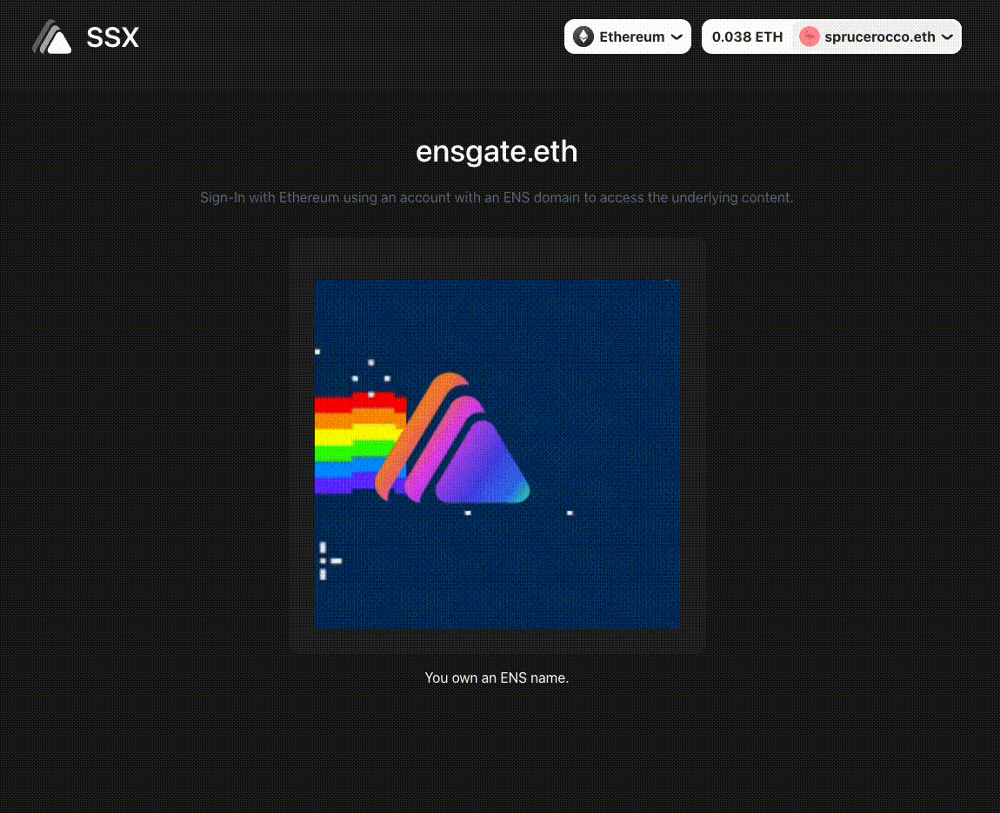
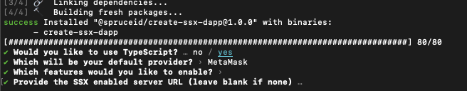

# Build a Token-Gated Dapp

Gating access to content based on a user's NFTs or tokens is a core-building block for building rich dapp experiences. For example:

* If a DAO wanted to limit content based on users with a certain amount of token-based voting power.
* If an NFT PFP project wanted to offer exclusive content to token holders.
* If a project wanted to enable early access to an application based on holding an NFT.

This example will show developers how to build and enable token-gated access in their dapp with SSX based on holding an ENS name.&#x20;

Additionally, it will show a developer how to also use SSX with [RainbowKit](https://www.rainbowkit.com/) and [Alchemy](https://www.alchemy.com/).&#x20;

## SSX Token-Gated Application

### Run our Completed Example

Want to jump in and see a token-gated example in action quickly? Perform the following steps:

* Ensure SSX packages are installed from the `ssx` directory by running `yarn install`
* Navigate to the example directory (`cd examples/ssx-test-token-gated`)
* Add an [Alchemy API](https://dashboard.alchemy.com/) key to `.env`
* In your terminal, run:&#x20;

```
yarn install
yarn start
```

Once run, you will be presented with a dapp using RainbowKit that prompts you to connect your wallet and Sign-In with Ethereum.

<figure><figcaption></figcaption></figure>

After signing in, if the wallet used owns an ENS name, you will be presented with the gated content. If not, the dapp should display "No ENS name found"&#x20;

<figure><figcaption></figcaption></figure>

The following guide will teach you how to create a token-gated dapp enabled by SSX from our `create-ssx-dapp` package.&#x20;

### **Create the Dapp Yourself**

The initial setup will be done using SSX's dapp creation tool. Type the following in your terminal to get started:

```bash
yarn create @spruceid/ssx-dapp token-gated-example
```

For this example, we will be using the following explicit options in the setup tool:

* Typescript
* Leave the other options empty when prompted&#x20;

<figure><figcaption><p>The <code>create-ssx-dapp</code> tool</p></figcaption></figure>

### Set up Alchemy Account

An [Alchemy account](https://www.alchemy.com/) and API key will be necessary since `alchemy-sdk` is used to see if a user has an ENS name.

To configure the key in the project, create a `.env` file and add the key there:

```bash
# token-gated-example/.env
REACT_APP_ALCHEMY_API_KEY=YOUR_KEY
```

### Set up the Alchemy SDK and RainbowKit

The Alchemy SDK dependency can be installed with the following command in the directory of your dapp:

```bash
yarn add alchemy-sdk
```

[RainbowKit](https://www.rainbowkit.com/) is also used in this example. Add the required dependency via the following command:

```bash
yarn add @rainbow-me/rainbowkit wagmi
```

Additionally, you will also need to add the `ssx-react` dependency. To add it, use this command:

```bash
yarn add @spruceid/ssx-react
```

Head to `src/index.tsx` and add the following to plug things in initially:

```tsx
/** src/index.tsx **/

import { RainbowKitProvider, getDefaultWallets } from '@rainbow-me/rainbowkit';
import {
  goerli,
  mainnet,
  configureChains,
  createClient,
  WagmiConfig,
} from 'wagmi';
import { alchemyProvider } from 'wagmi/providers/alchemy';
import { publicProvider } from 'wagmi/providers/public';
import { SSXProvider } from '@spruceid/ssx-react';

const { chains, provider } = configureChains(
  [mainnet, goerli],
  [
    alchemyProvider({
      // This is Alchemy's default API key.
      // You can get your own at https://dashboard.alchemyapi.io
      apiKey: `${process.env.REACT_APP_ALCHEMY_API_KEY}`,
    }),
    publicProvider(),
  ]
);

const { connectors } = getDefaultWallets({
  appName: 'SSX ENS Token Gated Example',
  chains,
});

const wagmiClient = createClient({
  autoConnect: true,
  connectors,
  provider,
});
```

Wrap your `<App />` component with `<WagmiConfig />`, `<RainbowKitProvider/>` and `<SSXProvider/>` components, making it look like the following:

```tsx
/* src/index.tsx */

root.render(
  <React.StrictMode>
    <WagmiConfig client={wagmiClient}>
      <RainbowKitProvider chains={chains}>
        <SSXProvider>
          <App />
        </SSXProvider>
      </RainbowKitProvider>
    </WagmiConfig>
  </React.StrictMode>
);
```

At `src/App.tsx` some changes are required to hook SSX and RainbowKit together.&#x20;

Add the following imports and update the `App` component as the code below:

```tsx
/* src/App.tsx */

/* Add useEffect to the existing useState bracket */
import { useEffect, useState } from 'react';
import '@rainbow-me/rainbowkit/styles.css';
import {
  useConnectModal,
  useAccountModal,
  ConnectButton,
} from '@rainbow-me/rainbowkit';
import { useSSX } from '@spruceid/ssx-react';
import { SSXClientSession } from '@spruceid/ssx';
import { useSigner } from 'wagmi';

/*....*/

function App() {
  /* SSX hook */
  const { ssx } = useSSX();
  /* RainbowKit ConnectModal hook */
  const { openConnectModal } = useConnectModal();
  /* RainbowKit Account modal hook */
  const { openAccountModal } = useAccountModal();
  /* Some control variables */
  const [session, setSession] = useState<SSXClientSession>();
  const [loading, setLoading] = useState<boolean>(false);
  const { data: provider } = useSigner();
  
  useEffect(() => {
    if (ssx && loading) {
      /* Sign-in with SSX whenever the button is pressed */
      ssx
        .signIn()
        .then(session => {
          console.log(session);
          setSession(session);
          setLoading(false);
        })
        .catch(err => {
          console.error(err);
          setSession(undefined);
          setLoading(false);
        });
    }
  }, [ssx, loading]);
  
  useEffect(() => {
    if (!provider) {
      setSession(undefined);
      setLoading(false);
    } else {
      setLoading(true);
    }
  }, [provider]);
  
  const handleClick = () => {
    /* Opens the RainbowKit modal if in the correct state */
    if (openConnectModal) {
      openConnectModal();
    }
    /* Triggers the Sign-in hook */
    setLoading(true);
  };
  
  return (
    <div className="App">
      <div className="App-header">
        
        <span>SSX</span>
        {openAccountModal && provider ? <ConnectButton /> : <></>}
      </div>
      <div className="App-title">
        <h1>SSX Example Dapp</h1>
        <h2>Connect and sign in with your Ethereum account</h2>
      </div>
      <div className="App-content">
        {!openConnectModal && provider ? (
          <>
            <AccountInfo address={`${session?.address}`} />
          </>
        ) : (
          <button onClick={handleClick}>SIGN-IN WITH ETHEREUM</button>
        )}
      </div>
    </div>
  );
}
```

Finally, replace your CSS in `src/App.css` with the following:

```css
/* src/App.css */
.App {
  text-align: center;
  display: flex;
  flex-direction: column;
  align-items: center;
  color: white;
  height: 100vh;
}

.App-content button {
  border: none;
  width: 100%;
  padding: 16px 24px;
  color: white;
  background: linear-gradient(107.8deg, #4c49e4 11.23%, #26c2f3 78.25%);
  border-radius: 12px;
  cursor: pointer;
  font-weight: 500;
  font-size: 16px;
  transition: all 150ms ease 0s;
  margin: 16px 0px;
}

.App button:disabled {
  pointer-events: none;
  opacity: 0.7;
}

.App button:hover {
  transform: scale(1.01);
}

.App-header {
  width: calc(100% - 128px);
  text-align: left;
  padding: 16px 64px;
  display: flex;
  align-items: center;
  background-color: #212121;
}

.App-header span {
  font-weight: 600;
  font-size: 32px;
  margin-right: auto;
}

.App-title {
  margin-top: auto;
}

.App-title h2 {
  font-weight: 400;
  font-size: 16px;
  color: #667080;
}

.App-logo {
  height: 40px;
  pointer-events: none;
  margin-right: 16px;
}

.App-content {
  margin-bottom: auto;
  width: 450px;
  max-width: 100%;
  background-color: rgba(39, 39, 39, 0.7);
  backdrop-filter: blur(2px);
  border-radius: 12px;
  padding: 30px;
}

.App-content h1 {
  font-size: 32px;
  line-height: 48px;
}

.App-account-info {
  margin-top: 16px;
  padding: 16px 8px;
  border: 1px solid #555555;
  border-radius: 12px;
  text-align: left;
}

.App-account-info b {
  color: #667080;
}
```

The dapp has now been configured in a very basic state and will let you simply sign in using RainbowKit.&#x20;

### Adding Token Gating

To token gate, we need to add some additional code and configuration.&#x20;

First, let's configure the `alchemy-sdk`. Add the following to `src/App.tsx`:

```tsx
/* src/App.tsx */
import { Network, Alchemy } from 'alchemy-sdk';
/**....**/

const alchemyConfig = {
  /* This is the same you used previously for RainbowKit */
  apiKey: process.env.REACT_APP_ALCHEMY_API_KEY,
  /* Change this to the appropriate network for your usecase */
  network: Network.ETH_MAINNET,
};

const alchemy = new Alchemy(alchemyConfig);
/**....**/
```

With the SDK configured, we now need to add the logic to verify if the signed-in address owns a token. In this case, we'll be gating based on an ENS name.&#x20;

To accomplish this, tokens owned by the address must be fetched and filtered for ENS names. ENS names are under the contract `0x57f1887a8bf19b14fc0df6fd9b2acc9af147ea85,`so a variable with that value needs to be added.&#x20;

Add the following after the `import` statements:

```tsx
/* src/App.tsx */
const ENS_CONTRACT = '0x57f1887a8bf19b14fc0df6fd9b2acc9af147ea85';
```

Including the modifications above to `src/App.tsx`, we can now add the additional logic needed to fetch tokens:

<pre class="language-diff"><code class="lang-diff"><strong>/*....*/
</strong><strong>
</strong>+ import { Network, Alchemy } from "alchemy-sdk";

+ const alchemyConfig = {
+   /* This is the same you used previously for RainbowKit */
+   apiKey: process.env.REACT_APP_ALCHEMY_API_KEY,
+   /* Change this to the appropriate network for your usecase */
+   network: Network.ETH_MAINNET,
+ };

+ const alchemy = new Alchemy(alchemyConfig);

+ const ENS_CONTRACT = '0x57f1887a8bf19b14fc0df6fd9b2acc9af147ea85';

/*....*/

function App() {
  /* SSX hook */
  const { ssx } = useSSX();
  /* RainbowKit ConnectModal hook */
  const { openConnectModal } = useConnectModal();
  /* RainbowKit Account modal hook */
  const { openAccountModal } = useAccountModal();
  /* Some control variables */
  const [session, setSession] = useState&#x3C;SSXClientSession>();
  const [loading, setLoading] = useState&#x3C;boolean>(false);
  const { data: provider } = useSigner();
+ const [ownEnsName, setOwnEnsName] = useState(false);

  useEffect(() => {
    if (ssx &#x26;&#x26; loading) {
      /* Sign-in with SSX whenever the button is pressed */
      ssx.signIn()
         .then((session) => {
          console.log(session);
+         alchemy.nft.getNftsForOwner(`${ssx.address()}`)
+           .then((nfts) => {
+             const ownENS = nfts.ownedNfts
+               .filter(({ contract }) => contract.address === ENS_CONTRACT)?.length > 0;
+             setOwnEnsName(ownENS);
              setSession(session);
              setLoading(false);
+           });
        })
        .catch((err) => {
          console.error(err);
+         setOwnEnsName(false);
          setSession(session);
          setLoading(false);
        });
    }
  }, [ssx, loading]);
  
  useEffect(() => {
    if (!provider) {
      setSession(undefined);
      setLoading(false);
    } else {
      setLoading(true);
    }
  }, [provider]);
  
  const handleClick = () => {
    /* Opens the RainbowKit modal if in the correct state */
    if (openConnectModal) {
      openConnectModal();
    }
    /* Triggers the Sign-in hook */
    setLoading(true);
  }
  
  return (
    &#x3C;div className="App">
      &#x3C;div className="App-header">
        &#x3C;img src={logo} className="App-logo" alt="logo" />
        &#x3C;span>SSX&#x3C;/span>
+       {openAccountModal &#x26;&#x26; ownEnsName &#x26;&#x26; provider ? &#x3C;ConnectButton /> : &#x3C;>&#x3C;/>}
      &#x3C;/div>
      &#x3C;div className="App-title">
        &#x3C;h1>SSX Example Dapp&#x3C;/h1>
        &#x3C;h2>Connect and sign-in with your Ethereum account&#x3C;/h2>
      &#x3C;/div>
      &#x3C;div className="App-content">
+       {!openConnectModal &#x26;&#x26; ownEnsName &#x26;&#x26; provider ? (
          &#x3C;>
            &#x3C;AccountInfo address={`${session?.address}`} />
+           &#x3C;br>&#x3C;/br>
+           &#x3C;>You own an ENS name.&#x3C;/>
          &#x3C;/>
        ) : (
+         &#x3C;>
+           &#x3C;button onClick={handleClick}>SIGN-IN WITH ETHEREUM&#x3C;/button>
+           &#x3C;br>&#x3C;/br>
+             {!openConnectModal &#x26;&#x26; !ownEnsName &#x26;&#x26; provider &#x26;&#x26; !loading ? (
+               &#x3C;>
+                 &#x3C;AccountInfo address={`${session?.address}`} />
+                 &#x3C;br>&#x3C;/br>
+                 No ENS name found.
+               &#x3C;/>
+             ) : (
+               &#x3C;>&#x3C;/>
+             )}
          &#x3C;/>
        )}
      &#x3C;/div>
    &#x3C;/div>
  );
}

export default App;

</code></pre>

Now you can gate any content with ENS names just by checking this `ownEnsName` variable.&#x20;

## What's Next?

Gating access to content isn't only limited to tokens. You can even gate access based on different forms of on-chain activity like:

* The number of trades a user has made on Uniswap.
* How much lending activity a user has on Aave.
* The number of times a user voted on-chain in a DAO's governance process.

It doesn't stop there - this can even be extended to gating based on off-chain credentials, and more! We'll continue highlighting these examples and show how much is possible by using SSX.&#x20;

Happy building!&#x20;
