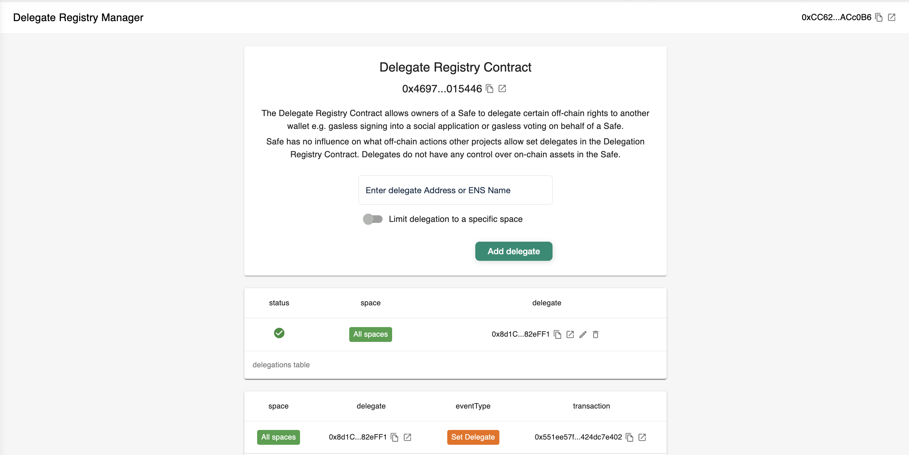

# DAO Login Workflow

_DAO Login_ is a workflow that allows _EOAs_ (externally owned accounts) or _smart contract wallets_ to log into apps or services on behalf of a _multisig wallet_. A _multisig wallet_ is a wallet that requires more than one private key to sign and authorize a transaction.

When DAOs or organizations that use multisigs need to make off-chain actions on apps or services (such as draft a governance proposal, or manage organizational profile information), they have problems due to there being no standard way for a decisionmaker to do it. This even extends beyond DAOs to include users that own multisigs and need a way to prove asset ownership held by the multisig while using an individual account to sign in to apps and services.&#x20;

We have collaborated with the [Gnosis Safe](https://gnosis-safe.io/) team to power a workflow that enables:

* Multisig owners to specify individual accounts to log in on behalf of the multisig
* Apps and services to enable this workflow


In order for your app to have DAO Logins enabled, make sure to follow the related section in our [configuration guide](../configuring-ssx/#enabling-dao-login).


In the Delegate Registry Manager app from the Gnosis Safe team, signers will be able to add a delegate that can log into apps and services on behalf of the multisig. This can be accomplished by inserting their address in the `Enter delegate Address or ENS Name` field and selecting `Add delegate`.&#x20;

<figure><figcaption>
The Gnosis Safe Delegate Registry App
</figcaption></figure>

Once confirmed, this will generate a transaction that the relevant multisig needs to get approved. After the signer threshold has been met and the transaction is completed, that delegate should now be in the `delegations table` as an approved delegate.&#x20;


We are currently collaborating with the Safe team on enabling multiple delegates to be added, as well as potentially app-specific spaces (e.g. someone who can sign in to a treasury management dapp but not a governance dapp).


Once enabled on an application, users that are delegates for multsigs will now be prompted to choose whether they would like to log in as themselves, or on behalf of a multisig they're a delegate of.&#x20;

 (1) (1).png>)

To test out this functionality locally, please make sure to check out the SSX Test Dapp:


