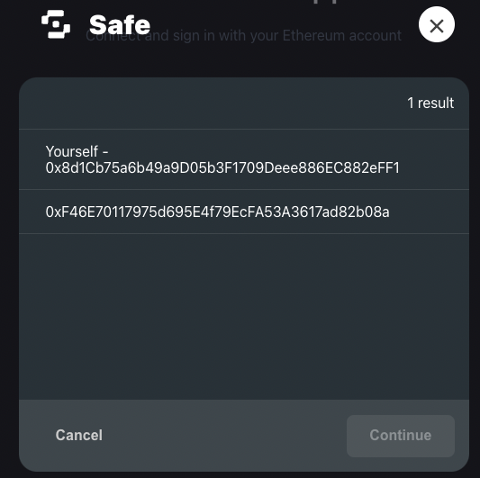

# DAO Login Workflow

DAO Login is a workflow that allows EOAs (externally owned accounts) or smart contract wallets to log into apps or services on behalf of a multisig wallet. A multisig wallet is a wallet that requires more than one private key to sign and authorize a transaction.

When DAOs or organizations that use multisigs need to make off-chain actions on apps or services (such as draft a governance proposal, or manage organizational profile information), they have problems due to there being no standard way for a decisionmaker to do it. This even extends beyond DAOs to include users that own multisigs and need a way to prove asset ownership held by the multisig while using an individual account to sign in to apps and services.&#x20;

We have collaborated with the[ Safe](https://gnosis-safe.io/) (formerly Gnosis Safe) team to power a workflow that enables:

* Multisig owners to specify individual accounts to log in on behalf of the multisig
* Apps and services to enable this workflow


In order for your app to have DAO Logins enabled, make sure to follow the related section in our [configuration guide](../configuring-ssx/#enabling-dao-login).


In the [Sign-In with Ethereum Delegate Registry Manager app](https://app.safe.global/share/safe-app?appUrl=https%3A%2F%2Fapps.gnosis-safe.io%2Fsiwe-delegate-manager\&chain=eth) from the Safe team, signers will be able to add a delegate that can log into apps and services on behalf of the multisig. This can be accomplished by inserting their address in the `Enter delegate Address or ENS Name` field and selecting `Add delegate`.&#x20;

<figure><figcaption>
The Safe Sign-In with Ethereum Delegate Registry Application
</figcaption></figure>

Once confirmed, this will generate a transaction that the relevant multisig needs to get approved. After the signer threshold has been met and the transaction is completed, that delegate should now be in the `delegations table` as an approved delegate.&#x20;


This integration currently supports multiple delegates on the same multisig.


Once enabled on an application, users that are delegates for multsigs will now be prompted to choose whether they would like to log in as themselves, or on behalf of a multisig they're a delegate of.&#x20;

To test out this functionality locally, please make sure to check out the SSX Test Dapp:


