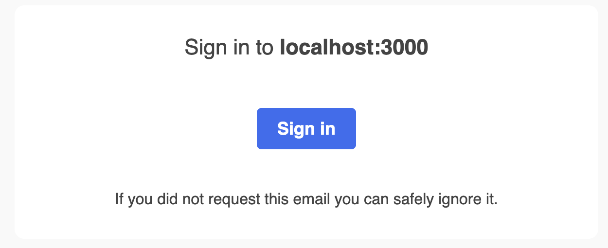

# From Email Login to SIWE

## Overview

Part of our continued work with SSX involves making Sign-In with Ethereum both as easy as possible for developers to integrate and support various environments and use cases. We've recently heard from developers that they wish to integrate Sign-In with Ethereum, but still would like to retain email-based login flows for their users. Typically this is to ensure that there is:

* Support for a traditional user base that may not be fully ready to use Sign-In with Ethereum, but some users have expressed interest and
* A means to still communicate with an existing user base through a means like email.

To get developers up and running with this approach, we've shipped a Next.js app that implements a login flow with NextAuth.js, SSX, and RainbowKit, but requires a user to first log in using their email.&#x20;



## Running the Example

To check out the example, first clone SSX, install any required dependencies, and navigate to the example by entering the following in your terminal:

```
git clone https://github.com/spruceid/ssx
cd ssx
yarn install
cd examples/ssx-test-nextauth-email
```

Next, make sure to rename `.env.example` to `.env`, and install dependencies by running `yarn` in your terminal.

This example also comes bundled with a fake local SMTP server with a web client that allows access to a mailbox using [docker](https://www.docker.com/). To run this local server, enter the following in your terminal:

```
docker run -d -p 1080:1080 -p 1025:1025 --name mailcatcher schickling/mailcatcher
```

Once the container is running, in a separate tab, navigate to the fake server by going to http://localhost:1080 in your browser.

Finally, this example uses SQLite for testing and Prisma as an adapter to connect the dapp to a database, but you can change the example database anytime.

Run the following commands to start the application:

```
npx prisma migrate dev
npx prisma generate
yarn dev
```

Once started, you should be presented with the following screen, prompting you to first sign-in using an email address. After hitting “Sign-In with Email” and entering any email address, you can access the magic sign-in link with the server running on localhost:1080.

<figure><figcaption></figcaption></figure>

Find the sign-in email sent, and hit the “Sign in” button to be redirected back to the dapp in a protected page only accessible by signed-in users.

<figure><figcaption></figcaption></figure>

Finally, connect your wallet using the provided button in the nav via RainbowKit. Once connected, hit “Link Your Ethereum Account” to Sign-In with Ethereum and link your Ethereum address to your email.\


<figure><figcaption></figcaption></figure>

Once this is complete, you can log out and Sign-In with Ethereum directly using the account you linked.
