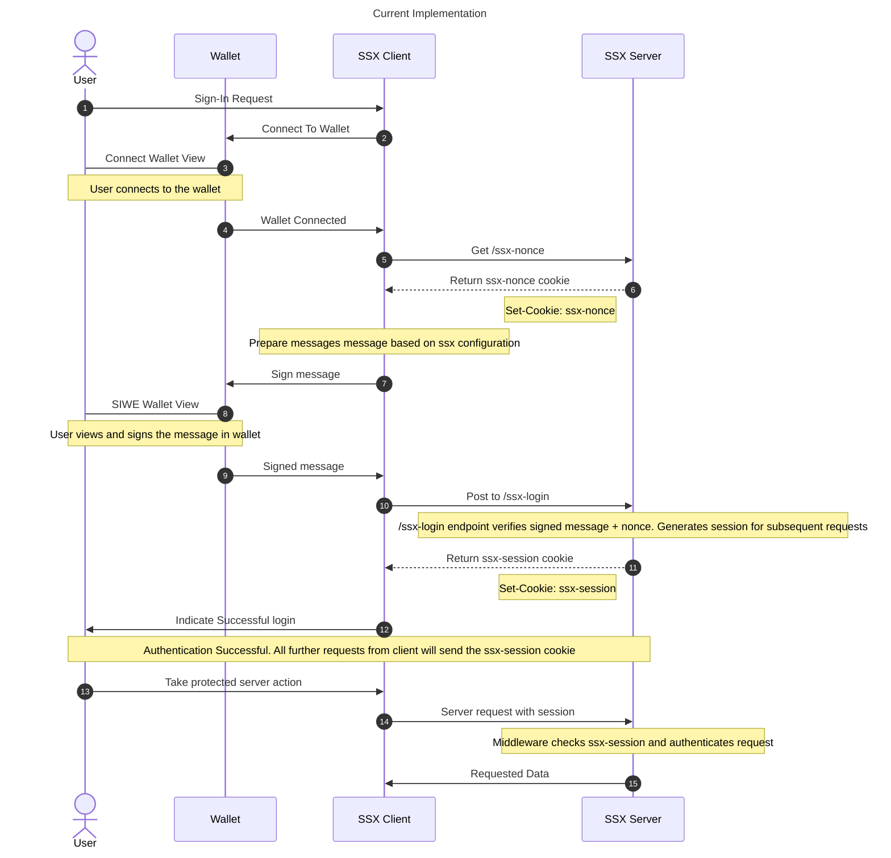

```mermaid
sequenceDiagram
    actor user as  User
    participant wallet as Wallet
    participant client as SSX Client
    participant server as SSX Server
    title Current Implementation
    autonumber
    
    user->>client: Sign-In Request
    client->>wallet: Connect To Wallet
    wallet->user: Connect Wallet View
    note over user, wallet: User connects to the wallet
    wallet->>client: Wallet Connected
    client->>server: Get /ssx-nonce
    server-->>client: Return ssx-nonce cookie
    note left of server: Set-Cookie: ssx-nonce
    Note over client: Prepare messages message based on ssx configuration
    client->>wallet: Sign message
    wallet->user: SIWE Wallet View
    note over user, wallet: User views and signs the message in wallet
    wallet->>client: Signed message
    client->>server: Post to /ssx-login
    Note over server: /ssx-login endpoint verifies signed message + nonce. Generates session for subsequent requests
    server-->>client: Return ssx-session cookie
    note left of server: Set-Cookie: ssx-session
    client->>user: Indicate Successful login
    Note over user,server: Authentication Successful. All further requests from client will send the ssx-session cookie
    user->>client: Take protected server action
    client->>server: Server request with session
    Note over server: Middleware checks ssx-session and authenticates request
    server->>client: Requested Data

```
